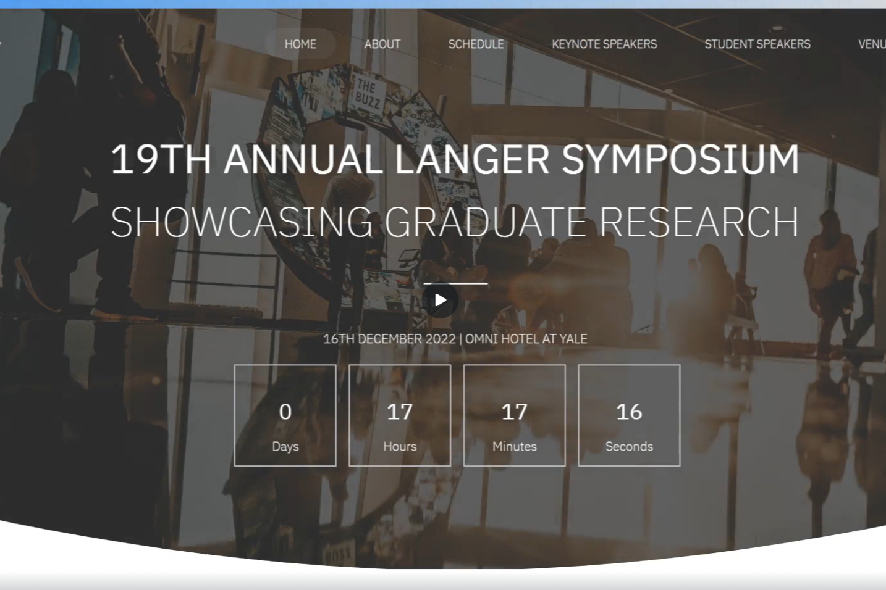

# Langer Symposium

This webpage showcases the 19th Annual Langer Symposium held in the Chemical & Environmental Engineering Department at Yale University. It features speakers, schedules, venue details, and the organizing committee.

**Link to project:** (https://rostacia.github.io/langersymposium/)

## How It's Made:

**Tech used:** HTML, CSS, JavaScript

This project was built using a combination of HTML, CSS, and JavaScript. The webpage structure was primarily created using HTML, ensuring semantic markup and accessibility. CSS was employed for styling elements, layout design, and responsive features. JavaScript was utilized to add interactivity and functionality to the webpage, such as dropdowns, navigation, and dynamic content loading.

## Optimizations

During the development process, optimizations were implemented to enhance user experience and performance. Specific attention was given to responsive design to ensure the site functions seamlessly across various devices and screen sizes.

## Lessons Learned:

Building this webpage provided valuable insights into crafting a user-friendly interface and managing event-related content. It allowed for hands-on experience in structuring event information effectively and creating an engaging online platform. Continuous learning was key, especially in understanding the importance of accessibility and responsive design practices.

